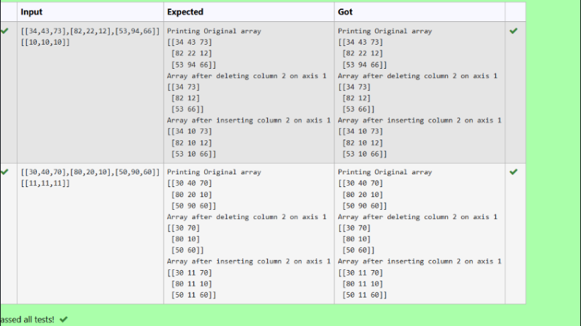

# NumPy Program: Replace the Second Column in a 2D Array

## 🎯 Aim
To write a **NumPy** program that deletes the second column from a given 2D array and inserts a new column at the same position.

## 🧠 Algorithm
1. **Import NumPy**: Start by importing the NumPy library.
2. **Get Input**: Get a 2D NumPy array and a new column (as another array) from the user.
3. **Delete Column**: Use `np.delete()` to remove the second column (index 1) from the original array.
4. **Insert Column**: Use `np.insert()` to insert the new column at the second column's original position.
5. **Display Result**: Print the updated array with the replaced column.

## 🧾 Program
```
import numpy as np
arr_str = input()
arr = np.array(eval(arr_str))
print("Printing Original array")
print(arr)
arr_deleted = np.delete(arr, 1, axis=1)
print("Array after deleting column 2 on axis 1")
print(arr_deleted)
new_col_str = input()
new_col = np.array(eval(new_col_str))
arr_final = np.insert(arr_deleted, 1, new_col, axis=1)
print("Array after inserting column 2 on axis 1")
print(arr_final)
```
## Output

## Result
Thus To write a NumPy program that deletes the second column from a given 2D array and inserts a new column at the same position is executed successfully